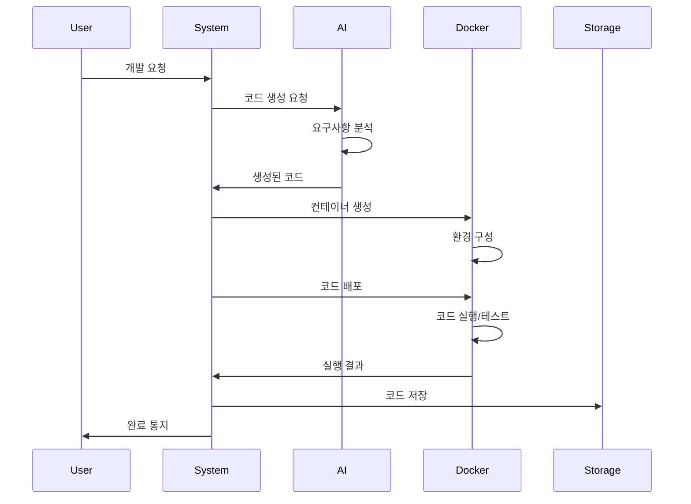

# AI 자율 개발 환경 구축 가이드 v1.0

## 1. 개요

AI 자율 개발 시스템은 안전하고 격리된 환경에서 코드를 생성, 실행, 테스트합니다. 본 문서는 AI가 실제로 개발을 수행하는 환경의 구조와 작동 방식을 설명합니다.

## 2. 개발 환경 아키텍처

### 2.1 전체 구조도

```
┌────────────────────────────────────────────────────┐
│                  사용자 인터페이스                   │
│              (웹 채팅 / 대시보드)                   │
└────────────────────────────────────────────────────┘
                         │
                         ▼
┌────────────────────────────────────────────────────┐
│              AI 오케스트레이터                      │
│         (작업 분배 및 조정)                        │
└────────────────────────────────────────────────────┘
                         │
        ┌────────────────┴────────────────┐
        ▼                                 ▼
┌─────────────────┐              ┌─────────────────┐
│   AI API 계층   │              │  개발 환경 계층  │
├─────────────────┤              ├─────────────────┤
│ • OpenAI GPT-4  │              │ • Docker 컨테이너│
│ • Claude API    │              │ • VSCode Server │
│ • Local LLMs    │              │ • 샌드박스 환경  │
└─────────────────┘              └─────────────────┘
        │                                 │
        └────────────────┬────────────────┘
                         ▼
┌────────────────────────────────────────────────────┐
│                  저장소 계층                        │
│          (Git, 파일 시스템, 데이터베이스)          │
└────────────────────────────────────────────────────┘
```

### 2.2 AI가 코드를 생성하는 과정

```yaml
code_generation_flow:
  1_request_parsing:
    input: "USDT 가격 모니터링 시스템 만들어줘"
    process:
      - requirement_analysis
      - context_building
      - template_selection
    
  2_ai_code_generation:
    api_calls:
      - model: "gpt-4-turbo"
        purpose: "아키텍처 설계"
        
      - model: "claude-3-opus"
        purpose: "상세 구현"
        
      - model: "gpt-3.5-turbo"
        purpose: "테스트 코드 생성"
    
  3_code_execution:
    environment: "isolated_docker_container"
    steps:
      - syntax_validation
      - dependency_installation
      - unit_testing
      - integration_testing
    
  4_quality_assurance:
    checks:
      - code_linting
      - security_scanning
      - performance_testing
      - documentation_generation
```

## 3. Docker 기반 샌드박스 환경

### 3.1 컨테이너 구성

```dockerfile
# 기본 개발 환경 Dockerfile
FROM node:18-alpine

# 필수 도구 설치
RUN apk add --no-cache \
    python3 \
    py3-pip \
    git \
    build-base \
    chromium \
    postgresql-client

# 개발 도구 설치
RUN npm install -g \
    typescript \
    jest \
    eslint \
    prettier \
    nodemon

# VSCode Server 설치
RUN wget -O- https://aka.ms/install-vscode-server/setup.sh | sh

# 보안 설정
RUN adduser -D -u 1000 aidev
USER aidev

WORKDIR /workspace

# 리소스 제한
CMD ["--memory=2g", "--cpus=1"]
```

### 3.2 컨테이너 오케스트레이션

```yaml
# docker-compose.yml
version: '3.8'

services:
  dev-environment:
    build: ./docker/dev-env
    volumes:
      - workspace:/workspace
      - shared-cache:/cache
    networks:
      - isolated-network
    security_opt:
      - no-new-privileges:true
    cap_drop:
      - ALL
    read_only: true
    tmpfs:
      - /tmp
      - /run
    
  code-executor:
    build: ./docker/executor
    depends_on:
      - dev-environment
    environment:
      - MAX_EXECUTION_TIME=300
      - MEMORY_LIMIT=1G
    networks:
      - isolated-network
    
  test-runner:
    build: ./docker/test-env
    volumes:
      - test-results:/results
    networks:
      - isolated-network

networks:
  isolated-network:
    driver: bridge
    internal: true

volumes:
  workspace:
  shared-cache:
  test-results:
```

## 4. AI와 개발 도구 통합

### 4.1 VSCode Server 웹 인터페이스

```javascript
// vscode-integration.js
const { VSCodeServer } = require('@vscode/server');
const Docker = require('dockerode');

class DevelopmentEnvironment {
  constructor() {
    this.docker = new Docker();
    this.vscodeServer = new VSCodeServer({
      port: 8443,
      connectionToken: process.env.VSCODE_TOKEN
    });
  }

  async createWorkspace(projectId) {
    // 1. Docker 컨테이너 생성
    const container = await this.docker.createContainer({
      Image: 'ai-dev-env:latest',
      name: `workspace-${projectId}`,
      Volumes: {
        '/workspace': {}
      },
      ExposedPorts: {
        '8443/tcp': {}
      }
    });

    await container.start();

    // 2. VSCode Server 시작
    const vscodeUrl = await this.vscodeServer.createSession({
      containerId: container.id,
      workspace: `/workspace/${projectId}`
    });

    return {
      containerId: container.id,
      vscodeUrl,
      status: 'ready'
    };
  }

  async executeCode(containerId, code, language) {
    const exec = await this.docker.getContainer(containerId).exec({
      Cmd: this.getExecutionCommand(code, language),
      AttachStdout: true,
      AttachStderr: true
    });

    const stream = await exec.start();
    return this.streamToString(stream);
  }

  getExecutionCommand(code, language) {
    const commands = {
      'javascript': ['node', '-e', code],
      'python': ['python3', '-c', code],
      'typescript': ['ts-node', '-e', code],
      'bash': ['bash', '-c', code]
    };
    
    return commands[language] || ['echo', 'Unsupported language'];
  }
}
```

### 4.2 AI 코드 생성 엔진

```javascript
// ai-code-generator.js
class AICodeGenerator {
  constructor() {
    this.openai = new OpenAI({ apiKey: process.env.OPENAI_API_KEY });
    this.anthropic = new Anthropic({ apiKey: process.env.ANTHROPIC_API_KEY });
  }

  async generateProject(requirements) {
    const project = {
      id: generateProjectId(),
      files: new Map(),
      tests: new Map(),
      docs: new Map()
    };

    // 1. 프로젝트 구조 생성
    const structure = await this.generateProjectStructure(requirements);
    
    // 2. 각 파일별로 코드 생성
    for (const file of structure.files) {
      const code = await this.generateFileCode(file, requirements);
      project.files.set(file.path, code);
      
      // 3. 테스트 코드 생성
      if (file.needsTest) {
        const test = await this.generateTestCode(file, code);
        project.tests.set(file.testPath, test);
      }
    }

    // 4. 문서 생성
    project.docs = await this.generateDocumentation(project);

    return project;
  }

  async generateFileCode(file, requirements) {
    const prompt = `
    프로젝트 요구사항: ${requirements}
    파일 경로: ${file.path}
    파일 역할: ${file.purpose}
    
    다음 사항을 준수하여 코드를 생성하세요:
    1. 프로덕션 레벨의 품질
    2. 적절한 에러 처리
    3. 주석과 JSDoc 포함
    4. 테스트 가능한 구조
    `;

    // 복잡한 파일은 Claude, 간단한 파일은 GPT-3.5 사용
    if (file.complexity === 'high') {
      return await this.anthropic.complete(prompt);
    } else {
      return await this.openai.complete(prompt);
    }
  }
}
```

## 5. 실행 환경 보안

### 5.1 샌드박스 보안 정책

```yaml
security_policies:
  container_isolation:
    - network: "격리된 내부 네트워크만 사용"
    - filesystem: "읽기 전용 루트 파일시스템"
    - capabilities: "모든 Linux capabilities 제거"
    - user: "non-root 사용자로 실행"
  
  resource_limits:
    - cpu: "1 core"
    - memory: "2GB"
    - disk: "10GB"
    - execution_time: "5분"
  
  code_scanning:
    - static_analysis: "Snyk, SonarQube"
    - dependency_check: "npm audit, pip-audit"
    - secrets_scanning: "GitLeaks"
    - malware_detection: "ClamAV"
```

### 5.2 실행 권한 관리

```javascript
// security-manager.js
class SecurityManager {
  async validateCode(code) {
    const violations = [];
    
    // 위험한 패턴 검사
    const dangerousPatterns = [
      /require\(['"]child_process['"]\)/,
      /eval\(/,
      /Function\(/,
      /\.env/,
      /process\.env/,
      /__dirname/,
      /require\(['"]fs['"]\)/
    ];
    
    for (const pattern of dangerousPatterns) {
      if (pattern.test(code)) {
        violations.push({
          type: 'dangerous_pattern',
          pattern: pattern.toString(),
          severity: 'high'
        });
      }
    }
    
    return {
      safe: violations.length === 0,
      violations
    };
  }
  
  async createSecureEnvironment(projectId) {
    return {
      env: {
        NODE_ENV: 'sandbox',
        PROJECT_ID: projectId,
        // 민감한 환경변수 제외
      },
      mounts: [
        { source: './workspace', target: '/workspace', readonly: false },
        { source: './node_modules', target: '/node_modules', readonly: true }
      ],
      limits: {
        memory: '2g',
        cpu: '1',
        pids: 100,
        ulimits: [{ name: 'nofile', soft: 1024, hard: 2048 }]
      }
    };
  }
}
```

## 6. 개발 워크플로우

### 6.1 전체 개발 프로세스



### 6.2 실시간 개발 모니터링

```javascript
// development-monitor.js
class DevelopmentMonitor {
  constructor() {
    this.metrics = {
      codeGeneration: new Map(),
      execution: new Map(),
      testing: new Map()
    };
  }

  async trackDevelopment(projectId) {
    const monitor = {
      startTime: Date.now(),
      phases: [],
      currentPhase: null,
      logs: []
    };

    // 코드 생성 단계
    monitor.currentPhase = 'code_generation';
    this.emit('phase:start', { projectId, phase: 'code_generation' });
    
    // 실행 단계
    monitor.currentPhase = 'execution';
    this.emit('phase:start', { projectId, phase: 'execution' });
    
    // 테스트 단계
    monitor.currentPhase = 'testing';
    this.emit('phase:start', { projectId, phase: 'testing' });
    
    return monitor;
  }
}
```

## 7. 로컬 개발 환경 설정

### 7.1 개발자를 위한 로컬 환경

```bash
# 로컬 개발 환경 설정 스크립트
#!/bin/bash

# 1. Docker 설치 확인
if ! command -v docker &> /dev/null; then
    echo "Docker를 설치해주세요"
    exit 1
fi

# 2. 필요한 이미지 빌드
docker build -t ai-dev-env:latest ./docker/dev-env
docker build -t ai-executor:latest ./docker/executor
docker build -t ai-tester:latest ./docker/test-env

# 3. 네트워크 생성
docker network create --internal ai-dev-network

# 4. 볼륨 생성
docker volume create ai-workspace
docker volume create ai-cache

# 5. 개발 환경 시작
docker-compose up -d

echo "✅ AI 개발 환경이 준비되었습니다!"
echo "🌐 VSCode: http://localhost:8443"
echo "📊 모니터링: http://localhost:3000"
```

### 7.2 환경 변수 설정

```env
# .env.development
# AI API Keys
OPENAI_API_KEY=sk-...
ANTHROPIC_API_KEY=sk-ant-...

# Development Environment
VSCODE_TOKEN=your-secure-token
DOCKER_HOST=unix:///var/run/docker.sock
MAX_CONTAINERS=10
CONTAINER_TIMEOUT=300

# Security
ENABLE_SANDBOX=true
ALLOW_NETWORK_ACCESS=false
MAX_EXECUTION_TIME=300
MAX_MEMORY_PER_CONTAINER=2048
```

## 8. 문제 해결 가이드

### 8.1 일반적인 문제와 해결방법

```yaml
common_issues:
  container_startup_failure:
    symptoms: "Container fails to start"
    causes:
      - "Port already in use"
      - "Insufficient resources"
      - "Image not found"
    solutions:
      - "Check port availability"
      - "Increase Docker resource limits"
      - "Rebuild images"
  
  code_execution_timeout:
    symptoms: "Code execution times out"
    causes:
      - "Infinite loops"
      - "Heavy computation"
      - "Network timeouts"
    solutions:
      - "Add execution limits"
      - "Optimize algorithms"
      - "Use async operations"
  
  ai_api_errors:
    symptoms: "AI fails to generate code"
    causes:
      - "API quota exceeded"
      - "Invalid API key"
      - "Network issues"
    solutions:
      - "Check API usage"
      - "Verify credentials"
      - "Implement retry logic"
```

## 9. 성능 최적화

### 9.1 리소스 최적화 전략

```yaml
optimization_strategies:
  container_reuse:
    description: "재사용 가능한 컨테이너 풀 유지"
    benefits:
      - "시작 시간 90% 감소"
      - "리소스 사용량 50% 감소"
    implementation:
      - warm_pool_size: 5
      - max_idle_time: 300
      - cleanup_interval: 3600
  
  layer_caching:
    description: "Docker 레이어 캐싱 활용"
    benefits:
      - "빌드 시간 80% 감소"
      - "네트워크 사용량 감소"
    
  code_caching:
    description: "생성된 코드 템플릿 캐싱"
    benefits:
      - "AI API 호출 50% 감소"
      - "응답 시간 향상"
```

## 10. 미래 확장 계획

### 10.1 고급 기능 로드맵

```yaml
future_features:
  gpu_support:
    description: "AI/ML 워크로드를 위한 GPU 지원"
    timeline: "Q2 2024"
    
  distributed_development:
    description: "여러 컨테이너에 걸친 분산 개발"
    timeline: "Q3 2024"
    
  real_time_collaboration:
    description: "여러 AI 에이전트의 실시간 협업"
    timeline: "Q4 2024"
    
  custom_environments:
    description: "프로젝트별 맞춤 개발 환경"
    timeline: "Q1 2025"
```

---

*이 문서는 AI 자율 개발 시스템의 실제 개발 환경 구축 방법을 설명합니다. 모든 개발은 이 환경 내에서 안전하게 수행됩니다.*

*최종 수정: 2024-01-26*
*다음 검토: 2024-02-26*