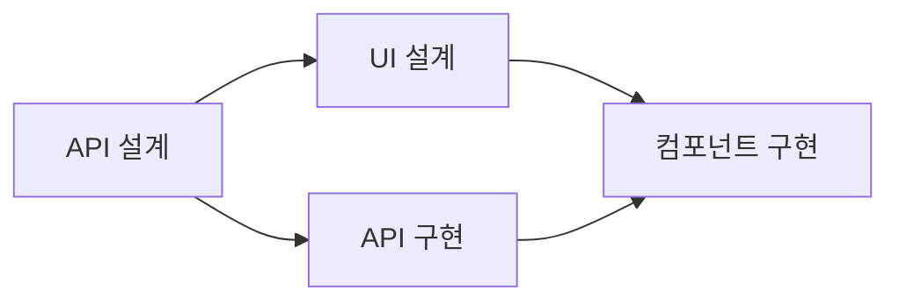

# AI 자율 개발 시스템 통신 프로토콜 명세서 v1.0

## 1. 개요

본 문서는 AI 자율 개발 생태계에서 AI 에이전트 간 통신을 위한 표준 프로토콜을 정의합니다. 모든 AI 에이전트는 이 프로토콜을 준수하여 문서를 작성하고 해석해야 합니다.

### 1.1 핵심 원칙
- **문서 기반 통신**: 모든 통신은 파일 시스템을 통한 문서 교환으로 이루어짐
- **비동기 처리**: 에이전트는 독립적으로 작동하며 동기화를 요구하지 않음
- **자기 완결성**: 각 문서는 처리에 필요한 모든 정보를 포함해야 함
- **추적 가능성**: 모든 문서는 고유 ID와 이력을 가져야 함

## 2. 문서 구조

### 2.1 표준 문서 형식

모든 문서는 YAML Front Matter + Markdown Body 형식을 따릅니다.

```markdown
---
# 필수 메타데이터
document_id: "TASK-2024-001-A1B2C3"  # 고유 식별자
document_type: "task_request"         # 문서 타입
version: "1.0"                        # 프로토콜 버전
created_at: "2024-01-26T10:00:00Z"   # ISO 8601 형식
created_by: "idea_collector"          # 생성 에이전트 ID

# 라우팅 정보
from: "idea_collector"                # 발신 에이전트
to: "task_planner"                    # 수신 에이전트
priority: "high"                      # urgent|high|normal|low
deadline: "2024-01-26T18:00:00Z"     # 처리 기한 (선택)

# 추적 정보
parent_id: "IDEA-2024-001"           # 상위 문서 ID (선택)
thread_id: "THREAD-2024-001"         # 작업 스레드 ID
sequence: 1                           # 스레드 내 순서

# 상태 정보
status: "pending"                     # pending|processing|completed|failed
processing_started_at: null           # 처리 시작 시간
processing_completed_at: null         # 처리 완료 시간

# 커스텀 메타데이터 (문서 타입별)
custom:
  estimated_complexity: "medium"      # 작업 복잡도
  required_skills: ["javascript", "api"]
---

# 문서 제목

문서 본문 내용...
```

### 2.2 문서 타입 정의

#### 2.2.1 작업 요청서 (task_request)
```markdown
---
document_type: "task_request"
to: "task_planner"
custom:
  task_type: "feature"  # feature|bugfix|refactor|analysis
  estimated_hours: 8
  dependencies: []
---

# 작업 요청: [작업 명]

## 목적
작업의 목적과 배경 설명

## 요구사항
- 구체적인 요구사항 1
- 구체적인 요구사항 2
- 구체적인 요구사항 3

## 제약사항
- 기술적 제약
- 비즈니스 제약
- 시간적 제약

## 예상 결과물
- 결과물 1
- 결과물 2

## 참고 자료
- [링크 1](url)
- [링크 2](url)
```

#### 2.2.2 작업 계획서 (task_plan)
```markdown
---
document_type: "task_plan"
from: "task_planner"
to: "task_distributor"
custom:
  total_subtasks: 5
  estimated_total_hours: 24
  critical_path: ["subtask-1", "subtask-3", "subtask-5"]
---

# 작업 계획: [작업 명]

## 작업 분해 구조 (WBS)

### 1. 백엔드 개발
- 하위 작업 1.1: API 설계 (2시간)
- 하위 작업 1.2: 데이터베이스 스키마 (1시간)
- 하위 작업 1.3: API 구현 (4시간)

### 2. 프론트엔드 개발
- 하위 작업 2.1: UI 설계 (2시간)
- 하위 작업 2.2: 컴포넌트 구현 (4시간)

## 의존성 그래프


## 리소스 할당
| 작업 ID | 담당 에이전트 | 예상 시간 | 우선순위 |
|---------|--------------|----------|----------|
| 1.1     | architect    | 2h       | HIGH     |
| 1.2     | architect    | 1h       | HIGH     |
| 1.3     | developer-1  | 4h       | HIGH     |
```

#### 2.2.3 작업 할당서 (task_assignment)
```markdown
---
document_type: "task_assignment"
from: "task_distributor"
to: "developer-1"
custom:
  task_id: "1.3"
  skill_requirements: ["nodejs", "express", "mongodb"]
  allocated_time: 4
  resources:
    - api_spec_doc: "DOC-2024-001"
    - db_schema: "SCHEMA-2024-001"
---

# 작업 할당: API 구현

## 작업 상세
구체적인 작업 내용...

## 입력 자료
- API 명세서: [링크]
- 데이터베이스 스키마: [링크]

## 완료 조건
- [ ] 모든 엔드포인트 구현
- [ ] 단위 테스트 작성
- [ ] API 문서 업데이트

## 제출물
- 소스 코드
- 테스트 결과
- 업데이트된 문서
```

#### 2.2.4 작업 결과 보고서 (task_result)
```markdown
---
document_type: "task_result"
from: "developer-1"
to: "task_distributor"
status: "completed"
custom:
  task_id: "1.3"
  actual_time: 3.5
  completion_percentage: 100
  quality_score: 95
---

# 작업 완료 보고: API 구현

## 완료된 작업
- ✅ 사용자 인증 API
- ✅ 데이터 CRUD API
- ✅ 파일 업로드 API

## 생성된 산출물
| 파일명 | 타입 | 라인 수 | 경로 |
|--------|------|---------|------|
| auth.js | 소스코드 | 250 | /src/api/auth.js |
| user.js | 소스코드 | 180 | /src/api/user.js |
| auth.test.js | 테스트 | 120 | /tests/auth.test.js |

## 테스트 결과
- 단위 테스트: 24/24 통과
- 통합 테스트: 8/8 통과
- 코드 커버리지: 92%

## 이슈 및 개선사항
- 성능 최적화 필요 부분 발견
- 보안 강화 권장사항

## 다음 단계 제안
1. 코드 리뷰 진행
2. 부하 테스트 실시
3. 보안 감사
```

#### 2.2.5 검토 요청서 (review_request)
```markdown
---
document_type: "review_request"
from: "task_distributor"
to: "reviewer"
custom:
  review_type: "code"  # code|design|security|performance
  target_documents: ["TASK-2024-001-RESULT"]
  review_checklist:
    - code_quality
    - security
    - performance
    - documentation
---

# 코드 리뷰 요청

## 검토 대상
- 작업 ID: 1.3
- 산출물: API 구현 코드

## 중점 검토 사항
1. 코드 품질 및 가독성
2. 보안 취약점
3. 성능 최적화 여부
4. 문서화 완성도

## 참고 기준
- 코딩 표준: [링크]
- 보안 가이드라인: [링크]
```

### 2.3 문서 명명 규칙

```
{document_type}-{timestamp}-{agent_id}-{unique_id}.md

예시:
- task_request-20240126-100000-idea_collector-A1B2C3.md
- task_result-20240126-140000-developer1-D4E5F6.md
```

## 3. 파일 시스템 구조

### 3.1 디렉토리 구조
```
/communication
  /inbox              # 수신함
    /{agent_id}/     # 각 에이전트별 수신함
  /outbox            # 발신함
    /{agent_id}/     # 각 에이전트별 발신함
  /processing        # 처리 중인 문서
    /{agent_id}/
  /completed         # 완료된 문서 (아카이브)
    /{date}/
  /failed           # 실패한 문서
    /{date}/

/shared            # 공유 리소스
  /templates       # 문서 템플릿
  /schemas         # 스키마 정의
  /knowledge       # 공유 지식 베이스

/workspace        # 작업 공간
  /current        # 현재 작업 중인 파일
  /artifacts      # 생성된 산출물
```

### 3.2 문서 라이프사이클

```
1. 생성 (Created)
   → 발신 에이전트의 outbox에 생성
   
2. 전송 (Sent)
   → 수신 에이전트의 inbox로 이동
   
3. 처리 중 (Processing)
   → processing 폴더로 이동
   → 상태를 'processing'으로 변경
   
4. 완료 (Completed)
   → 결과 문서를 outbox에 생성
   → 원본 문서를 completed 폴더로 이동
   
5. 실패 (Failed)
   → 에러 보고서 생성
   → failed 폴더로 이동
```

## 4. 통신 규칙

### 4.1 메시지 교환 패턴

#### 4.1.1 단방향 통신 (Fire-and-Forget)
```
A → B (응답 불필요)
```

#### 4.1.2 요청-응답 (Request-Response)
```
A → B (요청)
B → A (응답)
```

#### 4.1.3 파이프라인 (Pipeline)
```
A → B → C → D
```

#### 4.1.4 팬아웃 (Fan-out)
```
    → B
A → → C
    → D
```

### 4.2 우선순위 처리

1. **urgent**: 즉시 처리 (5분 이내)
2. **high**: 우선 처리 (30분 이내)
3. **normal**: 순차 처리 (2시간 이내)
4. **low**: 여유 시 처리 (24시간 이내)

### 4.3 에러 처리

#### 4.3.1 재시도 정책
- 최대 재시도 횟수: 3회
- 재시도 간격: 1분 → 5분 → 15분
- 재시도 실패 시 에러 보고서 생성

#### 4.3.2 에러 보고서 형식
```markdown
---
document_type: "error_report"
from: "developer-1"
to: "error_handler"
custom:
  original_task_id: "TASK-2024-001"
  error_code: "E001"
  error_category: "processing_failure"
  retry_count: 3
---

# 에러 보고서

## 에러 정보
- 에러 코드: E001
- 에러 메시지: API 생성 실패
- 발생 시간: 2024-01-26T14:30:00Z

## 상세 내용
구체적인 에러 설명...

## 시도한 해결 방법
1. 재시도 3회
2. 대체 방법 시도

## 권장 조치
- 수동 개입 필요
- 또는 작업 재설계 필요
```

## 5. 메타데이터 스키마

### 5.1 공통 메타데이터
```yaml
# JSON Schema 정의
CommonMetadata:
  type: object
  required:
    - document_id
    - document_type
    - version
    - created_at
    - created_by
    - from
    - to
    - priority
    - status
  properties:
    document_id:
      type: string
      pattern: "^[A-Z]+-[0-9]{4}-[0-9]{3}-[A-Z0-9]{6}$"
    document_type:
      type: string
      enum: 
        - task_request
        - task_plan
        - task_assignment
        - task_result
        - review_request
        - review_result
        - error_report
        - status_update
    version:
      type: string
      pattern: "^[0-9]+\\.[0-9]+$"
    created_at:
      type: string
      format: date-time
    priority:
      type: string
      enum: [urgent, high, normal, low]
    status:
      type: string
      enum: [pending, processing, completed, failed]
```

### 5.2 문서 타입별 커스텀 메타데이터

각 문서 타입은 추가적인 커스텀 메타데이터를 가질 수 있습니다.

```yaml
TaskRequestMetadata:
  type: object
  properties:
    task_type:
      type: string
      enum: [feature, bugfix, refactor, analysis, research]
    estimated_hours:
      type: number
      minimum: 0.5
    required_skills:
      type: array
      items:
        type: string
    dependencies:
      type: array
      items:
        type: string
```

## 6. 보안 고려사항

### 6.1 문서 무결성
- 모든 문서는 생성 시 체크섬 생성
- 수정 불가능한 읽기 전용 상태로 보관
- 변경 이력 추적

### 6.2 접근 제어
- 각 에이전트는 자신의 inbox/outbox만 접근 가능
- shared 폴더는 읽기 전용
- 민감 정보는 암호화

### 6.3 감사 로그
- 모든 문서 이동 기록
- 처리 시간 기록
- 실패 원인 기록

## 7. 성능 최적화

### 7.1 문서 크기 제한
- 메타데이터: 최대 10KB
- 본문: 최대 1MB
- 첨부 파일: 별도 저장소 활용

### 7.2 처리 효율성
- 배치 처리 지원
- 우선순위 큐 활용
- 병렬 처리 가능한 작업 식별

## 8. 버전 관리

### 8.1 프로토콜 버전
- 현재 버전: 1.0
- 하위 호환성 유지
- 주요 변경 시 메이저 버전 증가

### 8.2 마이그레이션
- 구버전 문서 자동 변환
- 점진적 업그레이드 지원

## 9. 모니터링 및 관찰성

### 9.1 추적 가능한 메트릭
- 문서 처리 시간
- 큐 대기 시간
- 에러율
- 처리량 (문서/시간)

### 9.2 상태 리포트
```markdown
---
document_type: "status_report"
report_type: "hourly"
period_start: "2024-01-26T10:00:00Z"
period_end: "2024-01-26T11:00:00Z"
---

# 시스템 상태 리포트

## 처리 통계
- 총 처리 문서: 150
- 성공: 145 (96.7%)
- 실패: 5 (3.3%)

## 에이전트별 성능
| 에이전트 | 처리량 | 평균 시간 | 에러율 |
|---------|--------|-----------|--------|
| planner | 45 | 2.3분 | 0% |
| developer-1 | 30 | 15.2분 | 3.3% |
| reviewer | 25 | 8.5분 | 0% |

## 병목 지점
- developer-2: 큐 대기 20개
- reviewer: 평균 처리 시간 증가 추세
```

## 10. 확장성 고려사항

### 10.1 새로운 에이전트 추가
1. 에이전트 ID 등록
2. inbox/outbox 폴더 생성
3. 역할 및 책임 정의
4. 라우팅 규칙 업데이트

### 10.2 새로운 문서 타입 추가
1. 문서 타입 정의
2. 메타데이터 스키마 정의
3. 처리 규칙 정의
4. 템플릿 생성

## 부록 A: 문서 템플릿

### A.1 빈 문서 템플릿
```markdown
---
document_id: ""
document_type: ""
version: "1.0"
created_at: ""
created_by: ""
from: ""
to: ""
priority: "normal"
parent_id: ""
thread_id: ""
sequence: 1
status: "pending"
processing_started_at: null
processing_completed_at: null
custom: {}
---

# 제목

## 섹션 1

내용...

## 섹션 2

내용...
```

### A.2 빠른 시작 예제

```javascript
// 문서 생성 예제
const createDocument = (type, from, to, content) => {
  const doc = {
    document_id: generateId(),
    document_type: type,
    version: "1.0",
    created_at: new Date().toISOString(),
    created_by: from,
    from: from,
    to: to,
    priority: "normal",
    status: "pending",
    ...content
  };
  
  return matter.stringify(content.body || '', doc);
};

// 문서 읽기 예제
const readDocument = (filePath) => {
  const fileContent = fs.readFileSync(filePath, 'utf-8');
  const { data: metadata, content: body } = matter(fileContent);
  return { metadata, body };
};
```

## 부록 B: 에러 코드

| 코드 | 설명 | 조치 |
|------|------|------|
| E001 | 문서 파싱 실패 | 문서 형식 확인 |
| E002 | 필수 메타데이터 누락 | 메타데이터 추가 |
| E003 | 알 수 없는 문서 타입 | 문서 타입 확인 |
| E004 | 수신자 없음 | 라우팅 정보 확인 |
| E005 | 처리 시간 초과 | 작업 분할 고려 |
| E006 | 의존성 해결 실패 | 의존 문서 확인 |
| E007 | 권한 없음 | 접근 권한 확인 |
| E008 | 리소스 부족 | 리소스 할당 조정 |

---

*이 문서는 AI 자율 개발 시스템의 핵심 통신 규약을 정의합니다. 모든 AI 에이전트는 이 프로토콜을 엄격히 준수해야 합니다.*

*최종 수정: 2024-01-26*
*다음 검토: 2024-02-26*