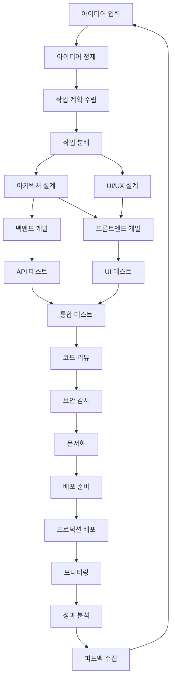
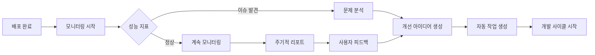

# AI 자동 개발 시스템 워크플로우 정의서 v1.0

## 1. 개요

본 문서는 AI 에이전트들이 아이디어부터 배포까지 전체 개발 프로세스를 자동으로 수행하는 워크플로우를 정의합니다. 모든 워크플로우는 문서 기반 통신을 통해 진행되며, 24시간 무중단으로 운영됩니다.

### 1.1 워크플로우 원칙
- **비동기 실행**: 각 단계는 독립적으로 실행
- **병렬 처리**: 가능한 작업은 동시 진행
- **자동 복구**: 실패 시 자동 재시도 및 대안 경로
- **추적 가능성**: 모든 단계의 상태 실시간 추적

## 2. 마스터 워크플로우

### 2.1 전체 프로세스 맵



### 2.2 단계별 상세 정의

#### PHASE 1: 아이디어 처리 (0-30분)
```yaml
phase: idea_processing
steps:
  - name: idea_reception
    agent: idea_collector
    input: idea_submission
    output: refined_idea
    timeout: 10min
    
  - name: feasibility_check
    agent: idea_collector
    input: refined_idea
    output: feasibility_report
    timeout: 20min
    
success_criteria:
  - technical_feasibility >= 70%
  - business_value >= 60%
  - resource_availability == true
```

#### PHASE 2: 계획 수립 (30분-2시간)
```yaml
phase: planning
steps:
  - name: work_breakdown
    agent: task_planner
    input: refined_idea
    output: wbs_document
    timeout: 30min
    
  - name: resource_planning
    agent: task_planner
    input: wbs_document
    output: resource_plan
    timeout: 20min
    
  - name: schedule_creation
    agent: task_planner
    input: [wbs_document, resource_plan]
    output: project_schedule
    timeout: 30min
```

#### PHASE 3: 개발 실행 (2-24시간)
```yaml
phase: development
parallel_tracks:
  - track: backend
    steps:
      - name: api_design
        agent: architect
        duration: 2h
      - name: database_design
        agent: architect
        duration: 1h
      - name: api_implementation
        agent: developer
        duration: 8h
      - name: api_testing
        agent: tester
        duration: 2h
        
  - track: frontend
    steps:
      - name: ui_design
        agent: architect
        duration: 2h
      - name: component_development
        agent: developer
        duration: 6h
      - name: ui_testing
        agent: tester
        duration: 2h
```

## 3. 세부 워크플로우

### 3.1 아이디어 → 작업 계획 워크플로우

```python
# 워크플로우 정의
idea_to_plan_workflow = {
    "name": "idea_to_plan",
    "version": "1.0",
    "steps": [
        {
            "id": "S1",
            "name": "receive_idea",
            "agent": "idea_collector",
            "actions": [
                "validate_idea_format",
                "extract_key_requirements",
                "research_similar_solutions"
            ],
            "output": "refined_idea",
            "next": "S2"
        },
        {
            "id": "S2", 
            "name": "analyze_feasibility",
            "agent": "idea_collector",
            "actions": [
                "technical_analysis",
                "resource_estimation",
                "risk_assessment"
            ],
            "output": "feasibility_report",
            "next": "S3",
            "failure": "S1"  # 재검토 필요시
        },
        {
            "id": "S3",
            "name": "create_plan",
            "agent": "task_planner",
            "actions": [
                "breakdown_tasks",
                "estimate_timeline",
                "assign_priorities"
            ],
            "output": "task_plan",
            "next": "S4"
        },
        {
            "id": "S4",
            "name": "validate_plan",
            "agent": "task_planner",
            "actions": [
                "check_dependencies",
                "verify_resource_allocation",
                "optimize_schedule"
            ],
            "output": "validated_plan",
            "next": "END"
        }
    ]
}
```

### 3.2 개발 → 테스트 워크플로우

```yaml
development_test_workflow:
  name: "development_to_test"
  version: "1.0"
  
  triggers:
    - type: document_created
      document_type: task_assignment
      condition: "task_type == 'development'"
  
  pipeline:
    - stage: development
      agent: developer
      steps:
        - setup_environment:
            actions:
              - create_branch
              - install_dependencies
              - configure_tools
        
        - implement_feature:
            actions:
              - write_code
              - add_unit_tests
              - update_documentation
            
        - self_review:
            actions:
              - run_linter
              - check_test_coverage
              - verify_requirements
      
      output:
        - source_code
        - unit_tests
        - dev_documentation
    
    - stage: testing
      agent: tester
      steps:
        - prepare_test_env:
            actions:
              - setup_test_database
              - load_test_data
              - configure_test_tools
        
        - execute_tests:
            parallel:
              - run_unit_tests
              - run_integration_tests
              - run_e2e_tests
        
        - analyze_results:
            actions:
              - generate_coverage_report
              - identify_failures
              - classify_bugs
      
      output:
        - test_report
        - bug_list
        - coverage_metrics
```

### 3.3 배포 워크플로우

```javascript
// 배포 워크플로우 구현
class DeploymentWorkflow {
  constructor() {
    this.stages = [
      'pre_deployment_check',
      'build_artifacts',
      'staging_deployment',
      'smoke_test',
      'production_deployment',
      'post_deployment_verification'
    ];
  }

  async execute(deploymentRequest) {
    const context = {
      request: deploymentRequest,
      artifacts: [],
      status: 'in_progress',
      rollbackPoint: null
    };

    for (const stage of this.stages) {
      try {
        context.currentStage = stage;
        await this.executeStage(stage, context);
        
        // 체크포인트 생성 (롤백용)
        if (stage === 'staging_deployment') {
          context.rollbackPoint = await this.createRollbackPoint();
        }
        
      } catch (error) {
        await this.handleFailure(stage, error, context);
        break;
      }
    }

    return context;
  }

  async executeStage(stage, context) {
    switch(stage) {
      case 'pre_deployment_check':
        return await this.preDeploymentCheck(context);
      case 'build_artifacts':
        return await this.buildArtifacts(context);
      // ... 기타 스테이지
    }
  }

  async handleFailure(stage, error, context) {
    // 자동 롤백 로직
    if (context.rollbackPoint && this.shouldRollback(stage)) {
      await this.rollback(context.rollbackPoint);
    }
    
    // 에러 보고서 생성
    await this.createErrorReport(stage, error, context);
  }
}
```

## 4. 병렬 처리 전략

### 4.1 병렬 가능 작업 식별

```yaml
parallel_execution_rules:
  can_parallelize:
    - condition: "no_shared_dependencies"
      example: "frontend_dev + backend_dev"
    
    - condition: "different_modules"
      example: "auth_module + payment_module"
    
    - condition: "independent_tests"
      example: "unit_tests + performance_tests"
  
  cannot_parallelize:
    - condition: "sequential_dependency"
      example: "design -> implementation"
    
    - condition: "shared_resources"
      example: "database_migration + api_testing"
```

### 4.2 작업 큐 관리

```python
class WorkQueue:
    def __init__(self):
        self.queues = {
            'urgent': PriorityQueue(),
            'high': PriorityQueue(),
            'normal': Queue(),
            'low': Queue()
        }
        self.processing = {}
        self.completed = []
    
    def enqueue(self, task):
        priority = task.metadata.priority
        self.queues[priority].put(task)
        
    def get_next_task(self, agent_type):
        # 우선순위 순서대로 확인
        for priority in ['urgent', 'high', 'normal', 'low']:
            queue = self.queues[priority]
            
            if not queue.empty():
                task = queue.get()
                
                # 에이전트 타입 매칭 확인
                if self.can_process(task, agent_type):
                    self.processing[task.id] = {
                        'task': task,
                        'agent': agent_type,
                        'started': datetime.now()
                    }
                    return task
                else:
                    # 다시 큐에 넣기
                    queue.put(task)
        
        return None
```

## 5. 피드백 루프

### 5.1 성과 → 개선 사이클



### 5.2 자동 학습 메커니즘

```yaml
learning_mechanism:
  success_patterns:
    - pattern: "test_first_development"
      success_rate: 0.85
      apply_when: "new_feature"
    
    - pattern: "incremental_deployment"
      success_rate: 0.92
      apply_when: "high_risk_change"
  
  failure_patterns:
    - pattern: "skip_code_review"
      failure_rate: 0.73
      avoid_when: "always"
    
    - pattern: "big_bang_deployment"
      failure_rate: 0.65
      avoid_when: "critical_system"
  
  optimization_rules:
    - if: "deployment_time > 30min"
      then: "parallelize_build_steps"
    
    - if: "test_failures > 10%"
      then: "increase_test_coverage_requirement"
```

## 6. 예외 처리 및 에스컬레이션

### 6.1 예외 상황 정의

```javascript
const exceptionHandlers = {
  'timeout': {
    threshold: '2x_estimated_time',
    actions: [
      'send_warning_notification',
      'check_agent_health',
      'attempt_restart'
    ],
    escalate_after: 3
  },
  
  'repeated_failure': {
    threshold: 3,
    actions: [
      'analyze_failure_pattern',
      'try_alternative_approach',
      'reduce_task_complexity'
    ],
    escalate_to: 'human_operator'
  },
  
  'resource_exhaustion': {
    indicators: ['memory > 90%', 'cpu > 95%'],
    actions: [
      'scale_resources',
      'optimize_workload',
      'defer_low_priority_tasks'
    ]
  },
  
  'circular_dependency': {
    detection: 'graph_cycle_check',
    actions: [
      'break_dependency',
      'reorganize_tasks',
      'alert_task_planner'
    ]
  }
};
```

### 6.2 에스컬레이션 매트릭스

| 상황 | 레벨 1 | 레벨 2 | 레벨 3 |
|------|--------|--------|--------|
| 작업 실패 | 자동 재시도 | 대안 방법 시도 | 인간 개입 요청 |
| 성능 저하 | 자동 최적화 | 리소스 증설 | 아키텍처 재검토 |
| 보안 이슈 | 즉시 격리 | 자동 패치 | 긴급 알림 발송 |
| 데이터 손실 | 백업 복구 | 대체 소스 활용 | 수동 복구 프로세스 |

## 7. 모니터링 및 가시성

### 7.1 실시간 대시보드 메트릭

```yaml
dashboard_metrics:
  system_health:
    - agent_status: "active|busy|error|offline"
    - queue_depth: "per_priority_level"
    - processing_time: "average|p95|p99"
    
  workflow_metrics:
    - active_workflows: count
    - completion_rate: percentage
    - average_duration: by_workflow_type
    - bottlenecks: top_5
    
  quality_metrics:
    - code_quality_score: 0-100
    - test_coverage: percentage
    - bug_density: per_kloc
    - deployment_success_rate: percentage
    
  business_metrics:
    - features_delivered: count_per_day
    - time_to_market: hours
    - automation_roi: percentage
```

### 7.2 알림 규칙

```javascript
const alertRules = [
  {
    name: "agent_down",
    condition: "agent.status === 'offline' for 5 minutes",
    severity: "critical",
    actions: ["email", "slack", "auto_restart"]
  },
  {
    name: "queue_overflow", 
    condition: "queue.depth > 100",
    severity: "warning",
    actions: ["scale_agents", "notify_ops"]
  },
  {
    name: "repeated_failures",
    condition: "failure_rate > 0.3 in last_hour",
    severity: "critical",
    actions: ["pause_workflow", "investigate", "alert_human"]
  }
];
```

## 8. 최적화 전략

### 8.1 성능 최적화

```python
class WorkflowOptimizer:
    def analyze_bottlenecks(self, workflow_history):
        bottlenecks = []
        
        # 단계별 평균 처리 시간 분석
        for stage in workflow_history.stages:
            if stage.avg_duration > stage.expected_duration * 1.5:
                bottlenecks.append({
                    'stage': stage.name,
                    'severity': 'high',
                    'recommendation': self.get_optimization_recommendation(stage)
                })
        
        return bottlenecks
    
    def get_optimization_recommendation(self, stage):
        if stage.type == 'sequential':
            return "Consider parallelization"
        elif stage.queue_depth > 10:
            return "Add more agents"
        elif stage.failure_rate > 0.1:
            return "Improve error handling"
        else:
            return "Review agent efficiency"
```

### 8.2 비용 최적화

```yaml
cost_optimization_strategies:
  - strategy: "dynamic_scaling"
    description: "Scale agents based on workload"
    savings: "40-60%"
    
  - strategy: "off_peak_processing"
    description: "Schedule non-urgent tasks during off-peak"
    savings: "20-30%"
    
  - strategy: "cache_frequently_used"
    description: "Cache common operations results"
    savings: "30-50%"
    
  - strategy: "batch_processing"
    description: "Group similar tasks"
    savings: "25-35%"
```

## 9. 구현 로드맵

### Phase 1: 기본 워크플로우 (주 1-2)
- 선형 워크플로우 구현
- 기본 에이전트 통합
- 파일 기반 통신

### Phase 2: 병렬 처리 (주 3-4)
- 병렬 작업 스케줄러
- 작업 큐 시스템
- 부하 분산

### Phase 3: 자동 최적화 (주 5-6)
- 성능 모니터링
- 자동 스케일링
- 피드백 루프

### Phase 4: 엔터프라이즈 기능 (주 7-8)
- 고급 에러 처리
- 보안 강화
- 규정 준수

## 부록: 워크플로우 실행 예시

```javascript
// 전체 워크플로우 실행 예시
async function executeFullWorkflow(idea) {
  const workflow = new MasterWorkflow();
  
  // 1. 아이디어 처리
  const refinedIdea = await workflow.execute('idea_processing', {
    input: idea,
    agent: 'idea_collector'
  });
  
  // 2. 계획 수립
  const projectPlan = await workflow.execute('planning', {
    input: refinedIdea,
    agent: 'task_planner'
  });
  
  // 3. 병렬 개발 실행
  const developmentTasks = workflow.splitParallelTasks(projectPlan);
  const results = await Promise.all(
    developmentTasks.map(task => 
      workflow.execute('development', {
        input: task,
        agent: task.assignedAgent
      })
    )
  );
  
  // 4. 통합 및 테스트
  const integratedSystem = await workflow.execute('integration', {
    input: results,
    agent: 'integrator'
  });
  
  // 5. 배포
  const deployment = await workflow.execute('deployment', {
    input: integratedSystem,
    agent: 'deployer'
  });
  
  return {
    idea: idea,
    result: deployment,
    metrics: workflow.getMetrics()
  };
}
```

---

*이 문서는 AI 자율 개발 시스템의 워크플로우를 정의합니다. 모든 프로세스는 이 워크플로우에 따라 실행되어야 합니다.*

*최종 수정: 2024-01-26*
*다음 검토: 2024-02-26*